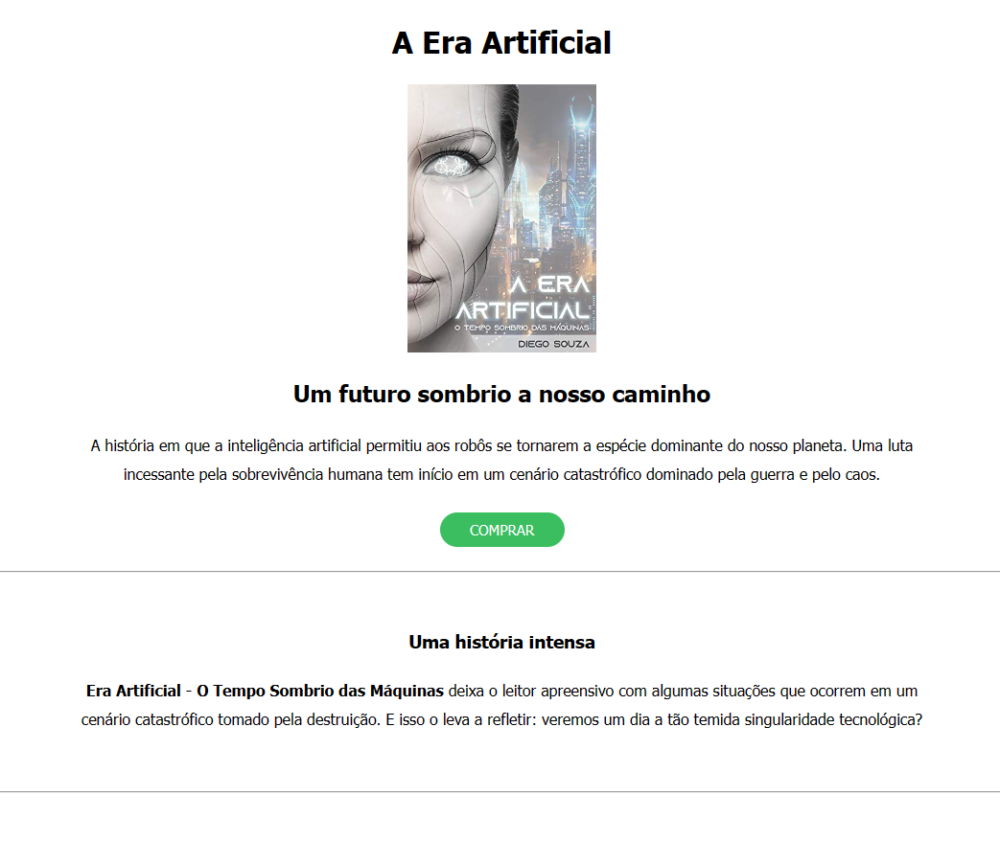

# Projeto-Iniciante-Front-08
O Projeto aqui é do nível Iniciante, utilizando HTML/CSS

 
    
    

#

#08 Amazon : Descrição da Página do Livro

O projeto simula uma Página de um livro vendido na Amazon, o projeto foi desenvolvido junto com os professores da <b>DevMedia</b>. Nele foi utilizado algumas tags como:

<b>HTML</b>

- div
- p
- h3
- link para compra do libro URL : https://www.amazon.com.br/Era-Artificial-tempo-sombrio-m%C3%A1quinas-ebook/dp/B07VFF5368/

<b>CSS</b>

- efeitos houver
- classes nos estilos
- margin
- padding

#

    

#

DevMedia : https://www.devmedia.com.br/  
Canal : https://www.youtube.com/@DevMediaBrasil
